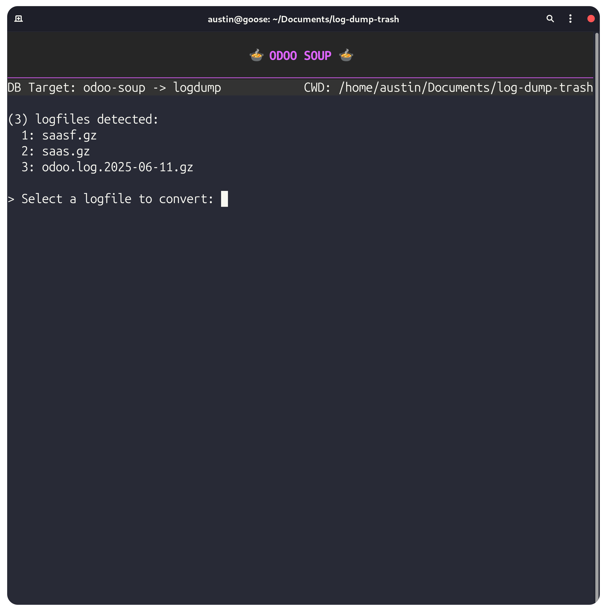
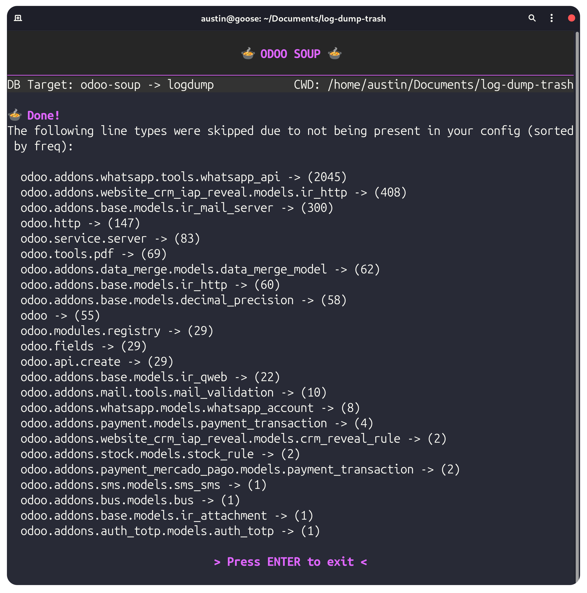
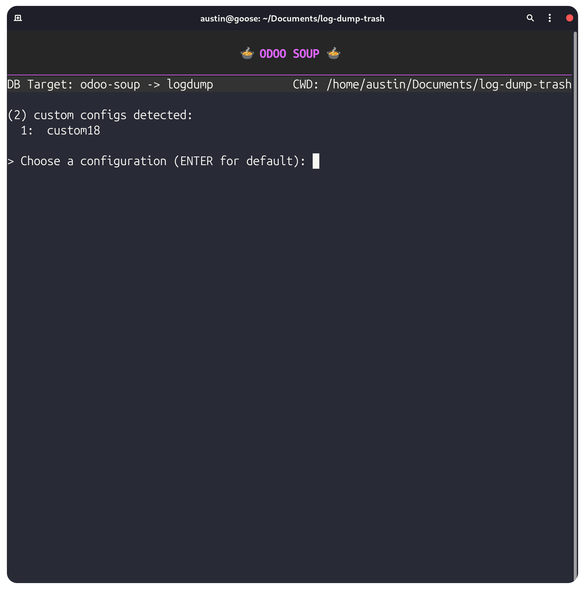

# 🍲 Odoo Soup


Create SQL tables from Odoo.sh log files for advanced diagnostics

## Features

- Easily extensible and configurable through .TOML config

- Parses many common Odoo log line types out of the box

- Odoo version agnostic due to ease of customization

- Automatically identifies field mapping blind-spots

- (Hopefully) just works

## Installation and Setup

### Clone the repo

Clone the repo somewhere cool.

```shell
git clone git@github.com:paau-odoo/odoo-soup.git && cd odoo-soup
```

### Make launch script executable

```shell
chmod +x ./odoo-soup
```

### Add to your PATH

Odoo soup will read log files automatically from your CWD when you use it, so you should probably do this for ease of use.

```shell
echo 'export PATH="$PATH:'"$(pwd)"'"' >> ~/.bashrc && source ~/.bashrc
```

Database setup and virtual environments/dependencies are handled automatically on first launch.

## Basic Usage

Logfile names are annoying to remember and type. Odoo Soup will scan your CWD for compatible files for you, so just specify a table name to import to:

```shell
$ odoo-soup <table name>
```

Choose the logfile in your CWD to import. If you have no custom configs, hitting enter will begin the import.



After a successful import, Odoo Soup will show you a list of log line types it encountered in your file which were **not** imported due to being absent from the selected configuration.



It is encouraged to only include relevant log line types during your imports since many the types not included in the default config do not have much parseable data. This is why skipped lines are displayed in descending frequency so that you can easily consider if you should write a custom config for any of them. We will cover this in the next section.

You can now access your import however you prefer to work with SQL.

## The Config File

### Introduction

Odoo Soup can be customized to both extend functionality and to be compatible with various Odoo versions. To do this, you may edit the config file with your preferred editor:

```shell
$ nano somewhere/odoo-soup/soups.toml
```

You should know that this program works by slicing each log line based on whitespace. You may access and modify any of these indices for a given line type through your config.

The SQL table has 12 columns to which you can map data to:

- date (datetime)
- level (string(15))
- origin (text)
- ip (string(64))
- http (string(10))
- route (text)
- code (int)
- time (double)
- user (text)
- object (text)
- records (text)
- text (text)

All records will have a plain text version of the log line added to `text` column, so you should not place anything into `text`.

Let's look at an example configuration entry:

```toml
[default.ir_rule]
pattern = "odoo.addons.base.models.ir_rule"
fields = [["object", -1], ["user", -3, [0, -1]]]
```

This entry is aliasing `odoo.addons.base.models.ir_rule` as `ir_rule` in the default configuration.
It is also specifying that additional fields `model`, `user` should be extracted from this line type.

An entry in `fields` has the following format:

```python
[<column-name>, <extraction index>, <optional: string slicing[startIndex, endIndex]>]
```

This should be self explanatory, but to better explain string slicing, these parameters would be translated into this python string slicing syntax:

```python
str[0:-1]
```

The end index is optional when specifying slicing indicies, and the start index is always required (use 0 if you don't need to slice the front)

### Configuration Inheritance

**All** fields across any configuration will inherit the `[default.default]` configuration:

```toml
[default.default]
fields = [["date", 0], ["level", 3], ["origin", 4], ["type", 5, [0, -1]]]
```

So in the prior example of `ir_rule`, 6 total fields will be extracted (4 `[default.default]` fields, 2 `[default.ir_rule]` fields)

When you create custom configuration sets (we will see this next), they will be additive to and inherit line configurations from the `default` set. You can select your custom config set at runtime.

The full flow of compiling the mapping instructions for any explicitly defined line type is as follows:

1. Load `[default.default]` mappings and slicing rules for all line types
2. Load individual line-type rules from `[default.<line type>]` on top
3. Merge custom config rules from `[<selected config set>.<line type>]` with existing ruleset, overwriting conflicting rules when applicable

Remember, if a line type is not explicitly defined in some way in the config, it will be skipped entirely. We will see the ways you can extend and add configurations next.

### Custom Configurations

While you can add and modify rules to the `default` rule set, it is probably better to make a custom config which inherits from `default` instead.

For example, suppose that the index where I would find a request's IP address is different in Odoo 15.0 logs. You might make a custom rule to account for this:

```toml
[custom15.web]
fields = [["ip", 3]]
```

Now, when I select the `custom15` config at runtime, the `IP` field for `web` lines will be overwritten. As previously discussed in the inheritance section, all of the other `[default.web]` rules for `web` will still persist.

Custom configurations will be accessible at runtime:


You can use this functionality to modify existing rules as shown above, or create new type aliases entirely by specifying a new search pattern:

```toml
[extended.http]
pattern = "odoo.http"
```

Of course you can specify additional parsing rules in the `fields`, but at this point this config will include the plaintext version of the log line in the `text` column as previously discussed, as well as all of the universal `[default.default]` fields. Here is an example with an additional field:

```toml
[extended.http]
pattern = "odoo.http"
fields = [["user", 3, [1,-3]]
```

### Resolving Matching Rules

Identical configurations are resolved by both their `alias` and the `pattern` field, meaning that you can use custom configurations to update these fields across Odoo versions if a model name were to change for instance. Suppose `odoo.addons.base.models.ir_rule` changed to `odoo.addons.base.models.ir_new_model_rule` for some reason. You can create a custom rule to fix this without necessarily modifying any other rules for the `ir_rule` alias:

```toml
[odoo19.ir_rule]
pattern = "odoo.addons.base.models.ir_new_model_rule"
```

Your output will now be identical despite the Odoo update.

Conversely, if the model remained unchanged as `odoo.addons.base.models.ir_rule` and you wanted to simply change the alias without modifying any rules, you can do that like so:

```toml
[custom.new_alias_name]
pattern = "odoo.addons.base.models.ir_rule"
```

This will result in the existing rule set being re-aliased as `new_alias_name`.

Hopefully these two examples demonstrate how rules can be resolved by either `pattern` or `alias`. I added this functionality so that the program hopefully just works in whatever way you intended.

## Notes

Sometimes, depending on Odoo versions, the default rule-set for a log line type may have index out of bounds errors due to log formatting. **These lines will fail silently and not be imported**. The rest of the log will still be imported. This was intentional as this tool should be used to very quickly identify data trends, and should just work out of the box as much as possible. I think it would be annoying have to waste time trying to fix 100 errors out right of the gate if you are just trying to identify general data trends. But, if you want, you can create a custom rule for that line type to correct those indices as previously explained.

Records and range selection of log line slices have not been re-implemented with the new extensible format, so the records column is kinda dead right now.
